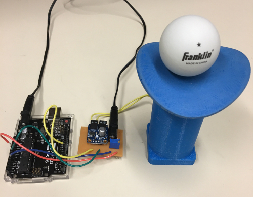

A video explaining and displaying the demonstration:

# Dynamic mechanical trap
Ion traps hold charge particles such as atoms or molecules that are missing an electron (they are "ionized").  They are powerful tools for quantum information science, precision optical timekeeping, quantum chemistry, nuclear physics, and even particle physics.  One type of ion trap, a Paul trap named after the Nobel Laureate  [Wolfgang Paul](https://en.wikipedia.org/wiki/Wolfgang_Paul), traps charged particles with a combination of static and dynamic electric fields.  The dynamic electric field that traps the ions is a bit difficult to visualize.  The mechanical analogue of the electric trap that we have developed in this repository helps one understand the forces and fields present in an ion trap.

The mechanical dynamic trap illustrates how oscillating electric fields can create a saddle point potential for a charged particle. In this case the "charged particle" is a ball, and by adjusting the rotational speed of the trap one can get a sense for how an ion is trapped in oscillating electric fields.

The trap build outlined in the [Guides](https://github.com/Jayich-Lab/Dynamic-Trap/tree/master/Guides) directory of this repository help bridge our research in the quantum regime, to something that you can recreate mechanically.  We have included all the files you need to make a dynamic trap, shown below, and background materials that hopefully prove helpful if you use this in a scientific demonstration.  We strongly believe in open science, and the license is intended to reflect that.  Please use the materials found in this repository however is most suitable to your needs.  

If you are interested in learning more about our research, visit our [lab's website](http://jayich.io/).

# Supplmental Information
Resources on a mechanical analogue to the quadrupole ion trap.

The stp file for the trap surface (saddle) is ready to print -- simply import into MakerBot Print and print.

The base is specific to the motor we used, a Uxcell gearbox motor. Modifications will be necessary if a different motor is used.

The mounting ring is used for mating the saddle to the D-shaped motor shaft. It fits a motor shaft with 6mm diameter with a 0.5mm (at thickest point) flat cut.
